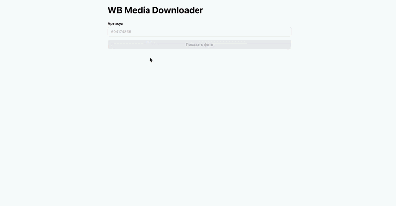

# wb-media-downloader

Тестовое задание выполнил [@qamalyann](https://t.me/qamalyann).

По артикулу Wildberries показывает фотографии карточки, складывает выбранные
в zip и собирает видео в mp4.

Стек: React 19, TypeScript strict, Vite, Mantine, TanStack Query, FSD.

## Демо



## Как запустить

Нужны Node 22+ и pnpm.

```
pnpm install
pnpm dev
```

Откроется на `http://localhost:5173`. Пример артикула: `604174866`.

```
pnpm lint
pnpm typecheck
pnpm test
```

## Как получаю медиа

Три шага: карточка, диапазоны корзин CDN, сборка ссылок.

**Карточка.** Публичный `card.wb.ru/cards/v4/detail`. Внутренний адрес из
задания закрыт антиботом: 403 и HTML вместо JSON. Из ответа беру только `id`,
`name`, `pics`. Остальное в типы не тащу: чужой контракт меняется без
предупреждения.

Без `dest` ответ приходит с `products: []` и статусом 200. Регион зашит
константой в одном месте.

Флага видео в карточке нет. Есть только недокументированные битовые маски.
Наличие видео проверяю запросом `HEAD` на плейлист: любой 2xx значит файл есть.

**Корзины.** В примере из задания диапазоны зашиты лестницей условий. Так
делать нельзя: Wildberries добавляет корзины, и ломаются только новые товары.
Диапазоны беру живым запросом из `upstreams`. Сейчас у фото 52 хоста. Зашитый
снимок есть только как аварийный запас, если запрос не прошёл, и помечен
комментарием, что источником истины не является.

Артикул вне карты даёт явную ошибку, а не ссылку с `undefined` в середине.

**Сборка.** `vol` и `spec` считаются из артикула, хост берётся из подходящего
диапазона. У видео своя карта, `videonme_route_map`, и другая формула. На это
есть тесты: середина диапазона, граница `vol_range_to`, артикул вне карты.

`pics` не гарантирует, что все ссылки живы. Битые плитки убираются по ошибке
загрузки изображения. Отдельный запрос на каждую ссылку не делаю: браузер и так
сообщает об этом при отрисовке.

## Что доделал бы для продакшена

**Видео на сервер.** Сейчас плейлист HLS, готового mp4 нет. Сегменты
скачиваются в браузере и склеиваются через `ffmpeg.wasm` без перекодирования.
Ядро весит около 30 МБ и тянется при первом использовании, в бандл не попадает
(389 kB). Из-за `COEP: require-corp` пришлось ставить `crossorigin="anonymous"`
на все картинки. На большом проекте сборка уходит на сервер: нет 30 МБ на
клиенте, изоляция не ломает остальное приложение, готовый файл кешируется.

**Свой прокси.** CORS сейчас обходится прокси Vite. В собранной сборке его нет.
Нужен бэкенд: кеш, лимиты, ретраи, одно место, где чинить чужой API.

**Регион от пользователя.** `dest` сейчас константа. Иначе люди в разных
регионах видят разную выдачу.

**Архив потоком.** Zip целиком живёт в памяти браузера. На двадцати фото это
терпимо, на двух сотнях нет.

**Сообщение, что корзины устарели.** Если `upstreams` упал, фотографии молча
собираются из снимка, а кнопка видео пропадает.

## Ограничения

- Внутренний адрес карточки из задания недоступен, используется публичный
  аналог.
- CORS обходится прокси дев-сервера. В собранной сборке не работает.
- `dest` зашит константой.
- Архив собирается в памяти браузера целиком.
- Ядро ffmpeg тянется с внешнего CDN.
- Кросс-доменная изоляция включена ради одной фичи и влияет на всё приложение.
- Если `upstreams` недоступен, фотографии идут из устаревшего снимка, видео
  пропадает, интерфейс молчит.
